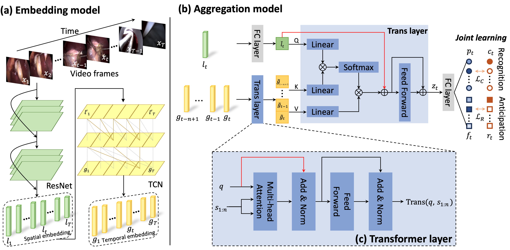

# Trans-SVNet: hybrid embedding aggregation Transformer for surgical workflow analysis
by [Yueming Jin](https://yuemingjin.github.io/), [Yonghao Long](https://scholar.google.com/citations?user=HIjQdFQAAAAJ&hl=zh-CN), [Xiaojie Gao](https://scholar.google.com/citations?user=Cu09UTYAAAAJ&hl=en), [Danail Stoyanov](https://www.ucl.ac.uk/surgical-robot-vision/people/danail-stoyanov), [Qi Dou](http://www.cse.cuhk.edu.hk/~qdou/), [Pheng-Ann Heng](http://www.cse.cuhk.edu.hk/~pheng/). 

## Introduction
* The Pytorch implementation for our paper '[Trans-SVNet: hybrid embedding aggregation Transformer for surgical workflow analysis](https://link.springer.com/article/10.1007/s11548-022-02743-8)', accepted at International Journal of Computer Assisted Radiology and Surgery (IJCARS).

* This is the extension version of our [2021 MICCAI paper](https://link.springer.com/chapter/10.1007/978-3-030-87202-1_57).

<p align="center">
  
</p>

## Data
* We use the datasets [Cholec80](http://camma.u-strasbg.fr/datasets), [M2CAI 2016 Challenge](http://camma.u-strasbg.fr/m2cai2016/index.php/program-challenge/) and [CATARACTS](https://ieee-dataport.org/open-access/cataracts).

* Please refer to [TMRNet](https://github.com/YuemingJin/TMRNet) repository for data preprocessing.

## Setup & Training

1. Check dependencies:
   ```
   - pytorch 1.0+
   - opencv-python
   - numpy
   - sklearn
   ```
2. Clone this repo
    ```shell
    git clone https://github.com/YuemingJin/Trans-SVNet_Journal
    ```

3. Generate labels and prepare data path information

* Run ``$ generate_phase_anticipation.py`` to generate the label of workflow anticipation

* Run ``$ get_paths_labels.py`` to generate the files needed for the training

4. Training

* Run ``$ train_embedding.py`` to train ResNet50 backbone

* Run ``$ generate_LFB.py`` to generate spatial embeddings

* Run ``$ tecno.py`` to train TCN for temporal modeling

* Run ``$ tecno_trans.py`` to train Transformer


## Testing

Our trained models can be found in ``./models/`` folder.

* Run ``$ trans_SV_output.py`` to generate the predictions for evaluation

We use the evaluation protocol of M2CAI challenge for evaluating our method.
Please refer to [TMRNet](https://github.com/YuemingJin/TMRNet/tree/main/code/eval/result/matlab-eval) repository for evaluation script.

## Citation
If this repository is useful for your research, please cite:
```
@ARTICLE{jin2022trans,  
  author={Jin, Yueming and Long, Yonghao and Gao, Xiaojie and Stoyanov, Danail and Dou, Qi and Heng, Pheng-Ann},  
  journal={International Journal of Computer Assisted Radiology and Surgery},   
  title={Trans-SVNet: hybrid embedding aggregation Transformer for surgical workflow analysis},
  volume={17},
  number={12},
  pages={2193--2202},
  year={2022},
  publisher={Springer}
}
```

### Questions

For further question about the code or paper, please contact 'ymjin5341@gmail.com'
